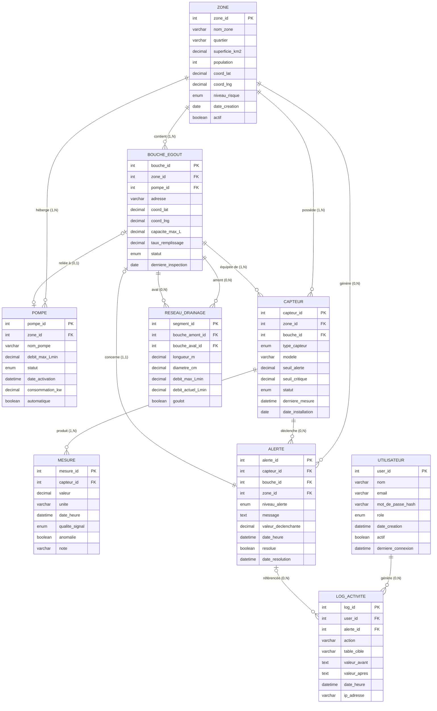

# MCD — Modèle Conceptuel de Données
## Urba-Drain Agadir · ENSIASD Taroudant · SIBD 2025-2026

> **Base** : `01_create_tables.sql` + `01_seed_data.sql`
> **Cardinalité** : `(min,max)` — côté source → côté cible

---

## Entités

### ZONE
| Attribut | Type | Contrainte |
|----------|------|-----------|
| **zone_id** | Entier | Identifiant |
| nom_zone | Chaîne(100) | |
| quartier | Chaîne(100) | |
| superficie_km2 | Décimal | |
| population | Entier | |
| coord_lat | Décimal | |
| coord_lng | Décimal | |
| niveau_risque | FAIBLE / MOYEN / ELEVE / CRITIQUE | |
| date_creation | Date | |
| actif | Booléen | |

*Seed : 22 zones (Hay Mohammadi, Talborjt, Bensergao, Anza … Najah)*

---

### POMPE
| Attribut | Type | Contrainte |
|----------|------|-----------|
| **pompe_id** | Entier | Identifiant |
| nom_pompe | Chaîne(100) | |
| debit_max_Lmin | Décimal | |
| statut | INACTIVE / ACTIVE / PANNE / MAINTENANCE | |
| date_activation | DateHeure | |
| consommation_kw | Décimal | |
| coord_lat | Décimal | |
| coord_lng | Décimal | |
| automatique | Booléen | |

*Seed : 13 pompes (P-HayMohammadi-01 … P-Founty-01)*

---

### BOUCHE_EGOUT
| Attribut | Type | Contrainte |
|----------|------|-----------|
| **bouche_id** | Entier | Identifiant |
| adresse | Chaîne(200) | Adresse réelle Agadir |
| coord_lat | Décimal | |
| coord_lng | Décimal | |
| capacite_max_L | Décimal | |
| taux_remplissage | Décimal(5,2) | 0–100 % |
| statut | NORMAL / ALERTE / SATURE / BLOQUE | |
| derniere_inspection | Date | |

*Seed : 16 bouches avec adresses réelles d'Agadir*

---

### CAPTEUR
| Attribut | Type | Contrainte |
|----------|------|-----------|
| **capteur_id** | Entier | Identifiant |
| type_capteur | NIVEAU_EAU / DEBIT / PRESSION / TEMPERATURE | |
| modele | Chaîne(100) | ex : HySense-NW200, FlowMeter-F5 |
| seuil_alerte | Décimal | ex : 70 cm |
| seuil_critique | Décimal | ex : 90 cm |
| statut | ACTIF / INACTIF / PANNE / MAINTENANCE | |
| derniere_mesure | DateHeure | MAJ par trigger |
| date_installation | Date | |

*Seed : 18 capteurs (modèles HySense, FlowMeter, InduSense, InduFlow, InduPress)*

---

### MESURE
| Attribut | Type | Contrainte |
|----------|------|-----------|
| **mesure_id** | Entier | Identifiant |
| valeur | Décimal(10,4) | ex : 52.20 cm, 780 L/min |
| unite | Chaîne(20) | cm / L/min / bar |
| date_heure | DateHeure | |
| qualite_signal | BONNE / MOYENNE / MAUVAISE / HORS_LIGNE | |
| anomalie | Booléen | |
| note | Chaîne(200) | |

*Seed : 18 mesures initiales normales (1 par capteur)*

---

### ALERTE
| Attribut | Type | Contrainte |
|----------|------|-----------|
| **alerte_id** | Entier | Identifiant |
| niveau_alerte | INFO / WARNING / CRITICAL / EMERGENCY | |
| message | Texte | Généré par trigger |
| valeur_declenchante | Décimal | |
| date_heure | DateHeure | |
| resolue | Booléen | |
| date_resolution | DateHeure | |

*Générée automatiquement par `trg_creation_alerte` (AFTER INSERT MESURE)*

---

### RESEAU_DRAINAGE
| Attribut | Type | Contrainte |
|----------|------|-----------|
| **segment_id** | Entier | Identifiant |
| longueur_m | Décimal | ex : 95 m, 420 m |
| diametre_cm | Décimal | ex : 40 cm, 60 cm |
| debit_max_Lmin | Décimal | |
| debit_actuel_Lmin | Décimal | Calculé par procédure |
| goulot | Booléen | TRUE si débit > 85 % max |

*Seed : 10 segments reliant les 16 bouches*

---

### UTILISATEUR
| Attribut | Type | Contrainte |
|----------|------|-----------|
| **user_id** | Entier | Identifiant |
| nom | Chaîne(100) | |
| email | Chaîne(150) | Unique |
| mot_de_passe_hash | Chaîne(255) | bcrypt |
| role | ADMIN / OPERATEUR / TECHNICIEN / LECTEUR | |
| date_creation | DateHeure | |
| actif | Booléen | |
| derniere_connexion | DateHeure | |

*Seed : 4 utilisateurs (1 par rôle RBAC)*

---

### LOG_ACTIVITE *(INSERT ONLY — jamais UPDATE ni DELETE)*
| Attribut | Type | Contrainte |
|----------|------|-----------|
| **log_id** | Entier | Identifiant |
| action | Chaîne(100) | ex : POMPE_ACTIVE, POMPE_ACTIVEE_AUTO |
| table_cible | Chaîne(50) | ex : POMPE |
| valeur_avant | Texte | |
| valeur_apres | Texte | |
| date_heure | DateHeure | |
| ip_adresse | Chaîne(45) | |

*Alimentée exclusivement par `trg_activation_pompe` et `trg_log_pompe`*

---

## Associations et cardinalités

```
ZONE ──────────(1,1)────── hébergée dans ──────(0,N)── POMPE
ZONE ──────────(1,1)────── contient       ──────(0,N)── BOUCHE_EGOUT
ZONE ──────────(1,1)────── possède        ──────(0,N)── CAPTEUR
ZONE ──────────(1,1)────── génère         ──────(0,N)── ALERTE

BOUCHE_EGOUT ──(1,1)────── équipée de     ──────(0,N)── CAPTEUR
BOUCHE_EGOUT ──(0,1)────── reliée à       ──────(0,1)── POMPE
BOUCHE_EGOUT ──(0,N)────── amont de       ──────(0,N)── BOUCHE_EGOUT
              [RESEAU_DRAINAGE : amont ≠ aval]

CAPTEUR ───────(1,1)────── produit        ──────(1,N)── MESURE
CAPTEUR ───────(1,1)────── déclenche      ──────(0,N)── ALERTE

ALERTE ────────(0,N)────── concerne       ──────(1,1)── BOUCHE_EGOUT
ALERTE         (0,N)────── référencée dans ─────(0,N)── LOG_ACTIVITE

UTILISATEUR ───(1,1)────── produit        ──────(0,N)── LOG_ACTIVITE
```

---

## Diagramme ER (Mermaid)



---

## Règles de gestion (issues du SQL)

| # | Source | Règle |
|---|--------|-------|
| RG01 | Schema FK | Chaque POMPE, BOUCHE_EGOUT, CAPTEUR appartient à exactement une ZONE |
| RG02 | Schema FK | Une BOUCHE_EGOUT peut être reliée à 0 ou 1 POMPE (`SET NULL` si pompe supprimée) |
| RG03 | Schema FK | Un CAPTEUR est obligatoirement associé à une BOUCHE_EGOUT de la même ZONE |
| RG04 | Schema CHECK | Un segment RESEAU_DRAINAGE relie deux bouches **différentes** (`bouche_amont_id <> bouche_aval_id`) |
| RG05 | `trg_creation_alerte` | INSERT MESURE → si `valeur >= seuil_critique` : ALERTE CRITICAL + bouche SATURE |
| RG06 | `trg_creation_alerte` | INSERT MESURE → si `valeur >= seuil_alerte` : ALERTE WARNING + bouche ALERTE (si NORMAL) |
| RG07 | `trg_activation_pompe` | UPDATE BOUCHE_EGOUT → si `taux_remplissage > 85%` : pompe associée ACTIVE (si INACTIVE & automatique) |
| RG08 | `trg_activation_pompe` | UPDATE BOUCHE_EGOUT → si `taux_remplissage < 30%` : pompe INACTIVE (si ACTIVE & automatique) |
| RG09 | `trg_log_pompe` | Tout changement de `statut` dans POMPE est tracé dans LOG_ACTIVITE |
| RG10 | `sp_simuler_cheminement_eau` | Goulot = segment où `debit_actuel > 85% * debit_max` |
| RG11 | LOG_ACTIVITE design | Table INSERT ONLY — aucun UPDATE ni DELETE jamais autorisé |
| RG12 | RBAC seed | 4 rôles : ADMIN, OPERATEUR, TECHNICIEN, LECTEUR |

---

*Urba-Drain Agadir · Équipe Augmenteds · ENSIASD Taroudant · SIBD 2025-2026*
